```{r setup, include=FALSE}
knitr::opts_chunk$set(echo = FALSE)
```

# Chapter 13 - Vector-Valued Functions

## 13.1 - Space Curves

```{r}
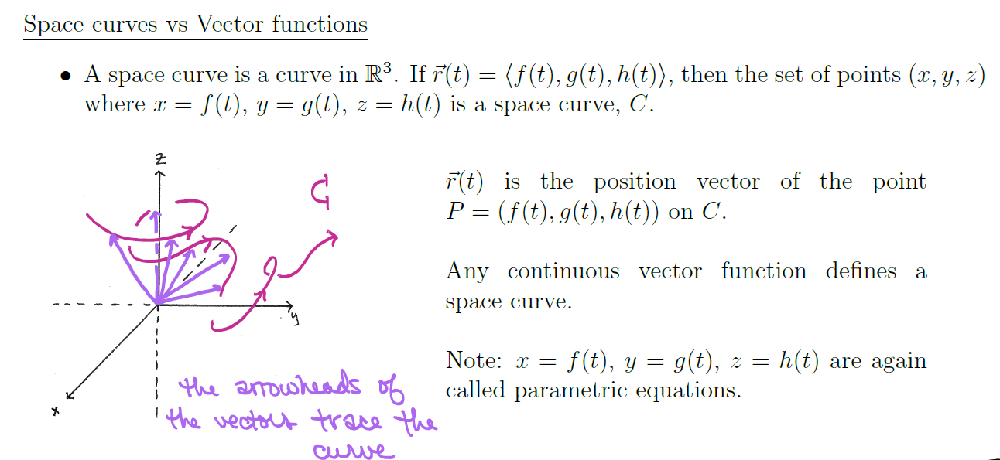
```

    Identify/sketch a curve from its vector equation

    Show a curve lies on a given surface. Use this to sketch the curve. 

    Parameterize a curve given Cartesian equations  
    (solve/eliminate variable; use trig: x = rcos,y=rsin)

```{r}
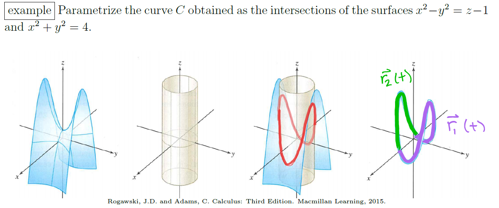
```


## 13.2-13.3 - Arc Length & Speed 

### Derivatives, Tangent Vector, Tangent Line, Integrals


```{r}
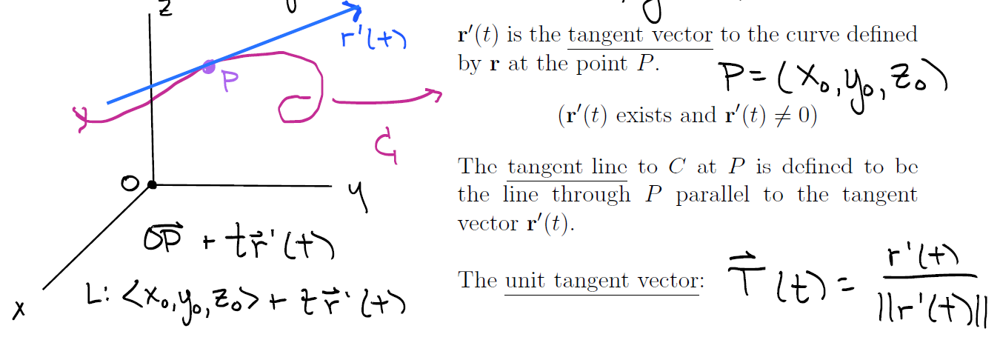
```

    Find the tangent vector of $r(t)$ at a given point.   
    Find the line tangent to a curve at a given point.  

```{r}
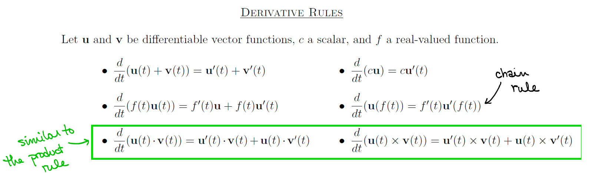

```

```{r}
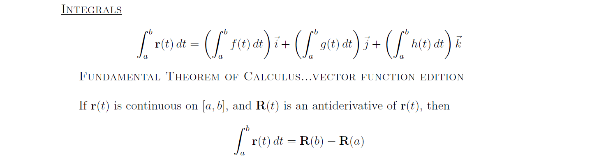
```

**Arc Length**: $\displaystyle L = \int_a^b \|\vec{r}'(t)\|dt = \int_a^b \sqrt{\bigg ( \frac{dx}{dt} \bigg )^2 + \bigg ( \frac{dy}{dt} \bigg )^2 + \bigg ( \frac{dz}{dt} \bigg )^2} dt$  
*Parametric*: $\displaystyle s(t) = \int_a^t \|\vec{r}'(u)\|du$  
(u is "placeholder")  

**Speed**: $\displaystyle \frac{ds}{dt} = \|\vec{r}'(t)\|$  
(at time *t*)

# Chapter 14 - Differentiation in Several Variables

## 14.1 - Functions of 2+ Variables

    Find and sketch the domain of the function

```{r}
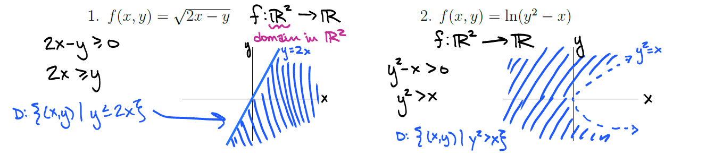

```

    Sketch graph of function

```{r}
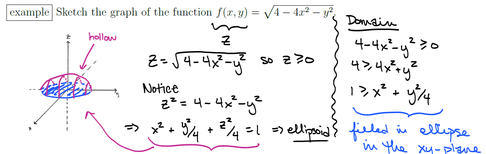

```


    Sketch level curves and contour maps of a function
    
```{r}
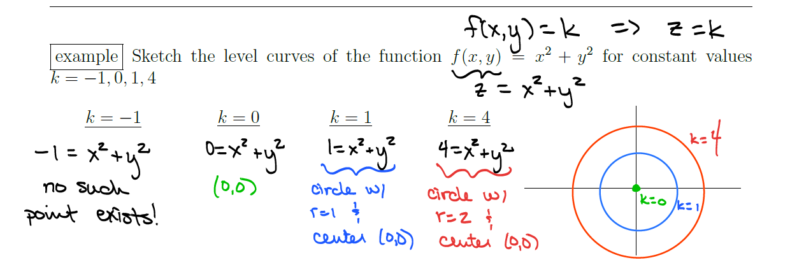
```
    
    
    Sketch *sections* (vertical traces) of a graph

## 14.2 - Limits and Continuity in Several Variables

$\displaystyle \lim_{x\rightarrow b}f(x) = L \Longleftrightarrow \bigg ( \forall \epsilon >0, \exists \delta >0 \ s.t. \sqrt{(x_1-b_1)^2 + (x_2-b_2)^2 + \dots + (x_n-b_n)^2} < \delta \implies |f(x)-L| < \epsilon \bigg )$  
$x = (x_1,x_2,\dots,x_n) \in D(f) \subset \mathbb{R}^n$

**Continuity**: $\displaystyle \lim_{(x,y) \rightarrow (a,b)} f(x,y) = f(a,b)$

**Limit Existence**: 

```{r}
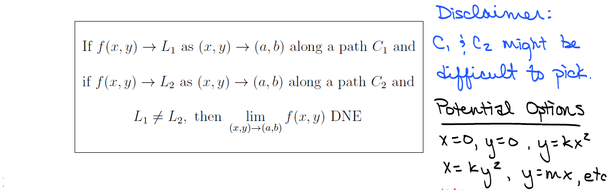

```

## 14.3 - Partial Derivatives

```{r}
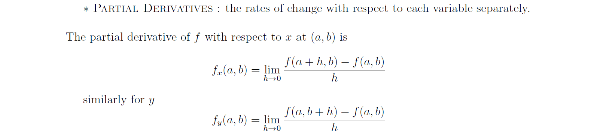
```

```{r}
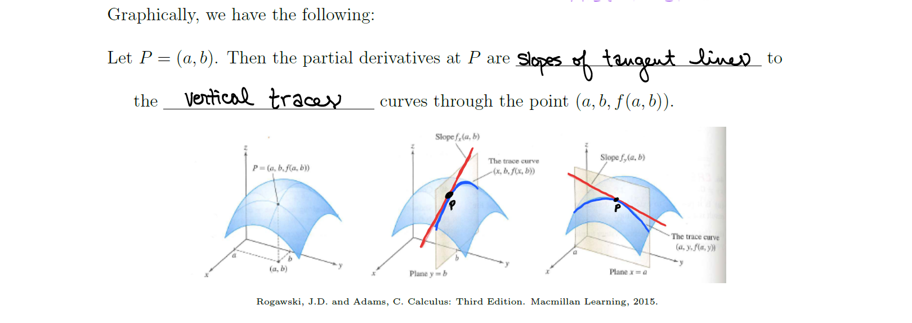

```

## 14.4 - Differentiability and Tangent Planes

```{r}
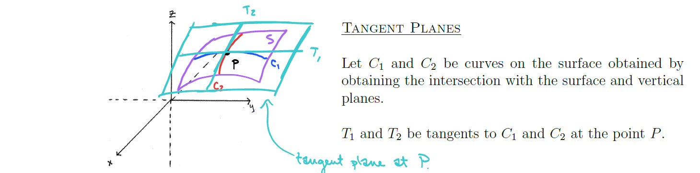
```

$z-z_0 = f_x(x_0, y_0)(x-x_0) + f_y(x_0,y_0)(y-y_0)$

*   Compare: $y-y_0 = f'(x_0)(x-x_0)$

**Linear Approximation:** The *linearization* of $f$ at $(a,b)$ --- $\displaystyle L(x,y) = f(a,b)+f_x(a,b)(x-a)+f_y(a,b)(y-b)$

## Differentials and Increments 

**Increments**: $\Delta z = f(a+\Delta x, b + \Delta y) - f(a,b)$

*Differentiability*: If $z = f(x,y)$, *f* is differentiable at $(a,b)$ if  

|   $\displaystyle \Delta z = f_x(a,b)\Delta x + f_y(a,b)\Delta y + \varepsilon_1 \Delta x + \varepsilon_2 \Delta z \ \ \text{and } \ \varepsilon_1,\varepsilon_2 \rightarrow 0$ as $(a,b) \rightarrow (0,0)$

**Theorem** --- if $f_x,f_y$ exist "near" $(a,b)$ and are continuous at $(a,b)$, then *f* is differentiable at $(a,b)$

**Differentials**: $dz = f_xdx + f_ydy, \  dz\ \approx \Delta z$

```{r}
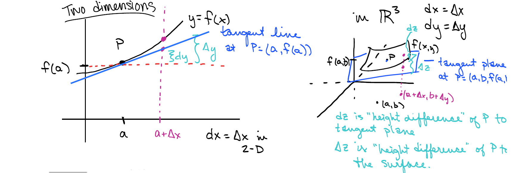
```

## 14.5 - Directional Derivatives and the Gradient of a Vector-Valued Function

The **directional derivative** of *f* at ($x_0, y_0, z_0)$ in the direction of a unit vector $\vec{u} = \langle a,b,c \rangle$: 

|   $D_{\vec{u}}f(x,y,z) = \lim_{h \rightarrow0} \displaystyle \frac{f(x_0 + ha, y_0 + hb, z_0 + hc) - f(x_0)}{h}$

**Theorem** --- $f(x,y,z)$ differentiable $\implies \forall \vec{u} = \langle a,b,c \rangle$, $f$ has a directional derivative:

|       $D_{\vec{u}}f(x,y,z) = f_x(x,y,z)a + f_y(x,y,z)b + f_z(x,y,z)c$

**Gradient**: $\displaystyle \nabla f(x,y,z) = \langle f_x, f_y, f_z \rangle =  \frac{\partial f}{\partial x}\vec{i} + \frac{\partial f}{\partial y}\vec{j} + \frac{\partial f}{\partial z}\vec{k}$  
(similar for function of two variables, $\nabla f(x,y) = \langle f_x, f_y \rangle$)

|       *Re: Directional Derivative*: $D_{\vec{u}}f(x,y,z) = \nabla f(x,y,z) \cdot \vec{u}$

Assume $\nabla f(p) \neq 0$:  

*   $\pm \nabla f(p)$ points in the direction of max rate of increase/decrease of *f* at *p*
*   $\nabla f(p)$ is normal to the level curve (or surface) of *f* at *p*  
        --- *tangent plane* of $f(x,y,z) = k \text{ at } p = (x_0, y_0, z_0)$: $\ \ \nabla f(x_0, y_0, z_0) \cdot \langle x-x_0, y-y_0, z-z_0 \rangle = 0$
*   $\|\nabla f(p)\|$ gives *max slope of a tangent line* (max rate of change) to the surface $z = f(x,y)$ at $(p,f(p))$

## 14.6 - The Chain Rule 

### 1.) z is a differentiable function of two single-parameter differentiable functions

$z= f(x(t), y(t)) \longrightarrow \displaystyle \frac{dz}{dt} = (\frac{\partial f}{\partial x})(\frac{dx}{dt}) + (\frac{\partial f}{\partial y})(\frac{dy}{dt})$ 

### 2.) z is a differentiable function of two "double"-parameter differentiable functions

$\displaystyle \frac{\partial z}{\partial s} = \frac{\partial f}{\partial x} \frac{\partial x}{\partial s} + \frac{\partial f}{\partial y} \frac{\partial y}{\partial s}$

$\displaystyle \frac{\partial z}{\partial t} = \frac{\partial f}{\partial x} \frac{\partial x}{\partial t} + \frac{\partial f}{\partial y}\frac{\partial y}{\partial t}$

### 3.) Implicit Differentiation 

```{r}
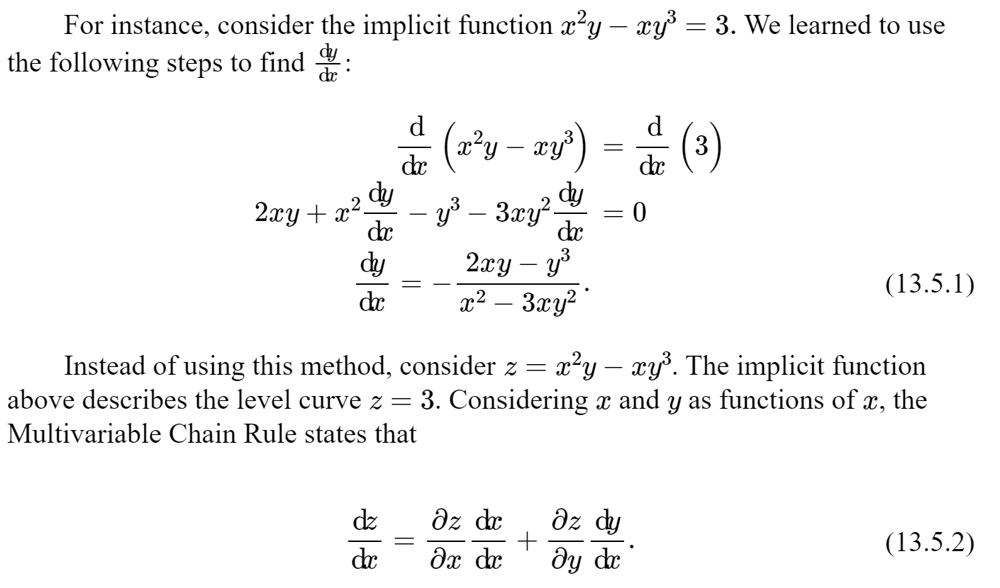
```
Note that $\displaystyle \frac{dx}{dx} = 1$ and, if *z* is constant, $\displaystyle \frac{dz}{dx} =0$. Hence $\displaystyle \frac{\partial z}{\partial y} \neq 0 \implies \ \frac{dy}{dx} = - \frac{\partial z}{\partial x}/\frac{\partial z}{\partial y} = \frac{f_x}{f_y}$

# Types of Questions 

### 13.1

    Identify/sketch a curve from its vector equation

    Show a curve lies on a given surface. Use this to sketch the curve. 

    Parameterize a curve given Cartesian equations  
    (solve/eliminate variable; use trig: x = rcos,y=rsin)
    
### 13.2-13.3
    
    Find the tangent vector of $r(t)$ at a given point.   
    
    Find the line tangent to a curve at a given point.  

### 14.1

    Find and sketch the domain of the multi-valued function

### 14.2

    Where is the function continuous?
    
    Determine if the limit exists and compute the limit if possible
    

