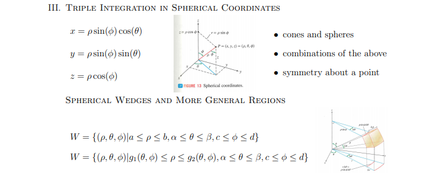

```{r setup, include=FALSE}
knitr::opts_chunk$set(echo = FALSE)
```

# Chapter 15 - Multiple Integration

## 15.1 - Two-Variable Integration Over Rectangles

$\displaystyle \bigg (\int_c^d \bigg ( \int_a^b f(x,y)dx \bigg )dy \bigg )$

$\displaystyle f_{avg} = \frac{1}{A(R)} \iint_R f(x,y) \ dA$  

$\displaystyle \iint_R f(x,y) \ dA \pm \iint_R g(x,y) \ dA = \iint_R f(x,y) \pm g(x,y) \ dA$

$\displaystyle \iint_R cf(x,y) \ dA = c \iint_R f(x,y) \ dA$

$\displaystyle \forall (x,y) \in \mathbb{R}^2, \ \  f(x,y) \geq g(x,y) \implies \iint_R f(x,y) \ dA \geq \iint_R g(x,y) \ dA$

$\displaystyle V = \iint_R f(x,y) - g(x,y) \ dA$ where $f(x,y)$ is top surface, $g(x,y)$ bottom
 
**Fubini's Theorem**: If *f* is continuous on the rectangle  $R = \{(x,y) \mid [a,b] \times [c,d]\}$, then: 

$\displaystyle \iint_R f(x,y) \ dA = \int_a^b \int_c^d f(x,y)dydx = \int_c^d \int_a^b f(x,y) dxdy$

*Partial* wrt *y*: $A(x) = \displaystyle \int_c^d f(x,y)dy \qquad$ ($A(x)$ possibly in terms of *x*)

*Partial* wrt *x*: $\displaystyle \int_a^b A(x)dx \ = \int_a^b \int_c^d f(x,y)dydx$


## 15.2 - Double Integrals Over More General Regions

### Vertically Simple (top, bottom terms of x)

$D = \{(x,y) \mid [a,b] \times [g_1(x),g_2(x)]\}$

If $f$ is continuous on $D$, $\displaystyle \iint_R f(x,y) \ dA = \int_a^b \int_{g_1(x)}^{g_2(x)}f(x,y) dydx$

```{r}

```


### Horizontally Simple (left, right terms of y)

$D = \{(x,y) \mid  [h_1(y),h_2(y)] \times [c,d]\}$ 

If *f* is continuous *D*, $\displaystyle \iint_D f(x,y) \ dA = \int_c^d \int_{h_1(y)}^{h_2(y)} f(x,y)dxdy$
```{r}
knitr::include_graphics("rmd_notebooks/15-2_fig2.png")
```


### Properties of the Integral

*Linearity, Homogeneity, Monotonicity*

**Additivity**: $D = D_1 \cup D_2 \dots \cup D_n$ (interior-disjoint)

$\iint_D f(x,y)\ dA = \iint_{D_1} f(x,y)\ dA + \dots + \iint_{D_n} f(x,y) \ dA$ (*see pg. 81*)

**Area of a Region**: $\text{Area}(D) = \iint_{D}1 \ dA$

**Estimation**: If $m \leq f(x,y) \leq M$ for all $(x,y) \in D$, 

$\displaystyle mA(D) \leq \iint_D f(x,y) \ dA \leq MA(D)$


## 15.3 - Triple Integrals ("Hyper-Volume")

$\displaystyle \iiint_W f(x,y,z) \ dV \qquad W \subset \mathbb{R}^3$

**W = Box** (*Fubini's Theorem*): If $f$ continuous on the rectangular box $B = [a,b] \times [c,d] \times [r,s]$ 

$\displaystyle \iiint_B f(x,y,z) \ dV = \int_r^s \int_a^b \int_c^d f(x,y,z) dydxdz$

Once again, can be evaluated in $\underline{\text{any order}}$. For 

**W = z-simple**: $W = \{(x,y,z) \mid u_1(x,y) \leq z \leq u_2(x,y), \ (x,y) \in D\}$ 

**W = x-simple (front/back)**: $W = \{(x,y,z) \mid u_1(y,z) \leq x \leq u_2(y,z), \ (y,z) \in D \}$


**W = y-simple (left/right)**: $W = \{(x,y,z) \mid u_1(x,z) \leq y \leq u_2(x,z), \ (x,z) \in D\}$

## 15.4 - Integration in Polar, Cylindrical, Spherical Coordinates

```{r}

```

If *f* continuous on $D = \{(r,\theta) \mid \alpha \leq \theta \leq \beta, \ g_1(\theta) \leq r \leq g_2(\theta)\}$

$\displaystyle \iint_D f(x,y) \ dA = \int_\alpha^\beta \int_{g_1(\theta)}^{g_2(\theta)} f(r\cos(\theta), r\sin(\theta))r \ drd\theta$


```{r}


```
If *f* continuous on *D*,

$\displaystyle \iiint_W f(x,y,z) \ dV = \int_\alpha^\beta \int_{g_1(\theta)}^{g_2(\theta)} \int_{u_1(r \cos(\theta), r \sin(\theta))}^{u_2(r \cos(\theta), r \sin(\theta))} f(r \cos(\theta), r \sin(\theta), z)rdzdrd\theta$


```{r}

```


If *f* continuous on *D*, 

$\displaystyle \iiint_W f(x,y,z) \ dV = \int_c^d \int_\alpha^\beta \int_{g_1(\theta, \phi)}^{g_2(\theta,\phi)} f(\rho \sin(\phi)\cos(\theta), \rho \sin(\phi)\sin(\theta),\rho \cos(\phi))\rho^2\sin(\phi)d\rho d \theta d \phi$

## 15.5 - Applications of Multiple Integrals

**Center of mass**: Given a lamina occupying *D* in $\mathbb{R}^2$ with variable density $\rho(x,y)$, 

$\displaystyle (X_{CM},Y_{CM}) = \bigg (\frac{M_y}{m},\frac{M_x}{m} \bigg)$ where $\displaystyle m = \iint_D \rho(x,y) \ dA \quad \displaystyle M_x = \iint_D y \rho(x,y) \ dA \quad  M_y = \iint_D x \rho(x,y) \ dA$

*3-D*: $\displaystyle (X_{CM}, Y_{CM}, Z_{CM}) = \bigg (\frac{M_{yz}}{m}, \frac{M_{xz}}{m}, \frac{M_{xy}}{m} \bigg )$ where $\displaystyle m = \iiint \rho(x,y,z) \ dV$, 

$\displaystyle \quad M_{xy} = \iiint z \rho(x,y,z) \ dV \quad M_{xz} = \iiint y \rho(x,y,z) \ dV \quad M_{yz} = \iiint x \rho(x,y,z) \ dV$

### Probability and Wait Times

$P(a \leq x \leq b) = \int_a^b f(x) dx$ where $\int_{-\infty}^\infty f(x)dx = 1\text{ and } f(x) \geq 1$ for all $x \in X$

**Joint** Probability: $\displaystyle P( (X,Y) \ \text{in} \ D) = \iint_D f(x,y) \ dA$ where $\displaystyle \int_{-\infty}^\infty \int_{-\infty}^\infty f(x,y) \ dA = 1$ and $f(x,y) \geq 0$

**Independent** variables: if joint density $f(x,y) = g(x)h(y)$, where $g(x)$ df(*X*), $h(y)$ df(*Y*)
 
**Wait-times example**: 
```{r}

```
Then compute $\displaystyle P(X + Y < 20) = \iint f(x,y) \ dA = \int_0^{20} \int_0^{20-x} \frac{1}{50}e^{-y/10}e^{-x/5} dydx$
 
## 15.6 - Change of Variables

```{r}

```


```{r}

```

 The **Jacobian Determinant** (Jacobian) of $T(u,v) = (x(u,v),y(u,v))$ helps calculate the area under a transformation (given numerous assumptions...): 
 
 $\displaystyle \iint_R f(x,y) \ dA = \iint_S f(x(u,v), y(u,v))$ $\bigg | \frac{\partial (x,y)}{\partial (u,v)}\bigg | dudv$
 
 It can also *estimate* the area: $\text{Area}(T(D)) \approx \bigg | \text{Jac}(T)\bigg | \text{Area}(D)$, $dA = \bigg |\frac{\partial (x,y)}{\partial (u,v)} \bigg | dudv$
 

```{r}

```


```{r}

```


