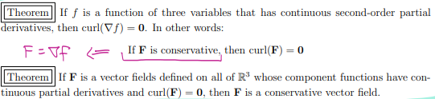
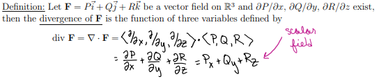
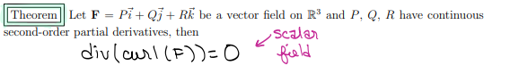
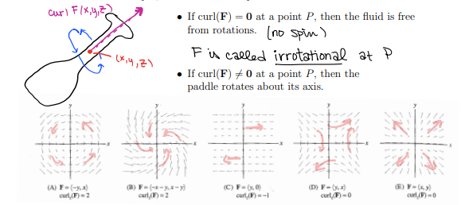
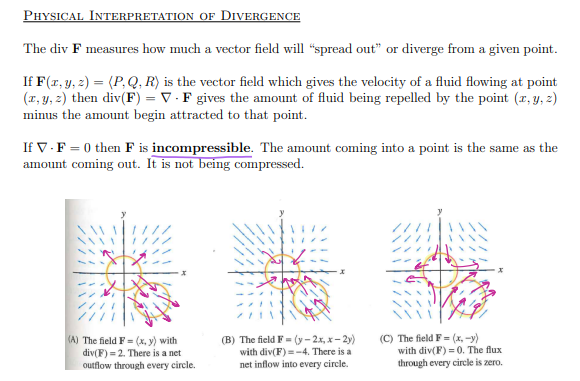

```{r setup, include=FALSE}
knitr::opts_chunk$set(echo = FALSE)
```

# 16.1 - Vector Fields

$\textbf{F}: D \longrightarrow \mathbb{R}^n, \ \textbf{F}(x_1, x_2,..., x_n) = \langle v_1, v_2,\dots, v_n \rangle$

*Scalar fields*: The real-valued scalar functions which are coefficients of the gradient field. 

*3-D*: $F(x,y,z) = P(x,y,z)\vec{i} + Q(x,y,z)\vec{j} + R(x,y,z)\vec{k}$
$F = \langle P,Q,R \rangle, \ \ F = \langle F_1, F_2, F_3 \rangle$

**Gradient Vector Field**: $\nabla f = \langle f_x, f_y, f_z \rangle = f_x (x,y,z)\vec{i} + f_y(x,y,z)\vec{j} + f_z(x,y,z)\vec{k}$

If $f(x,y,z)$ differentiable, its gradient vector field is a **conservative vector field** (*aka* a *potential function*).

$\mathbf{F} = \nabla f = \langle f_x, f_y, f_z \rangle$


## Operations on Vector Fields 

Let $\mathbf{F} = P\vec i + Q\vec j + R\vec k$ be a vector field on $\mathbb{R}^3$. 

**Vector differential operator**: $\displaystyle \nabla g = \bigg \langle \frac{\partial g}{\partial x}, \frac{\partial g}{\partial y}, \frac{\partial g}{\partial z} \bigg \rangle$

**Curl**: $\displaystyle \text{curl}(\mathbf{F}) = \nabla \times F = \bigg \langle \frac{\partial R}{\partial y} - \frac{\partial Q}{\partial z}, - \bigg (\frac{\partial R}{\partial x} - \frac{\partial P}{\partial z} \bigg), \frac{\partial Q}{\partial x} - \frac{\partial P}{\partial y} \bigg \rangle$ is a *vector field* on $\mathbb{R}^3$ 

```{r}

```


```{r}

```


```{r}

```


```{r}

```

```{r}

```


