```{r include = FALSE}
knitr::opts_chunk$set(echo = FALSE)
```

# Chapter 11 -- Parametric Equations, Polar Coord., Conic Sections

### 11.1 
*   Eliminate parameter to find Cartesian equation of curve 
*   Plot parametric curves: 

```{r}
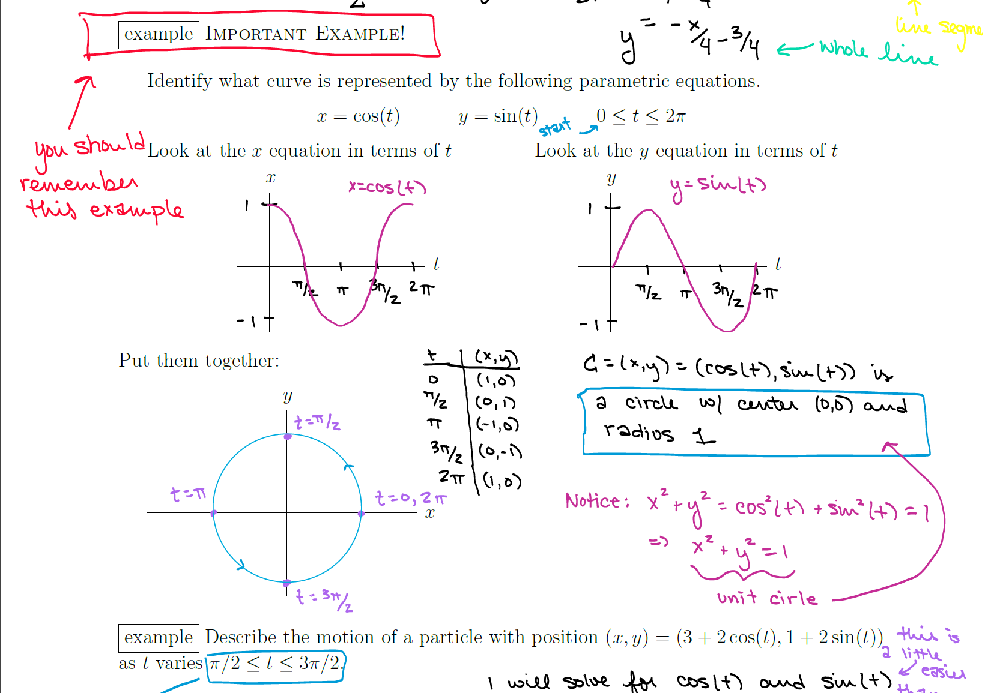
```

*   Use common parameterizations:

|   Line through $P = (a,b) \longrightarrow C = (a + rt, b+st)$ where $m = \displaystyle \frac{s}{r}, r \neq 0$
|   Line through $P,Q \longrightarrow C = (a + t(c-a), b+t(d-b))$

|   Circle: $C = (h + r\cos(t), k + r\sin(t)), \quad 0\leq t < 2\pi \ \text{ or } \ 0\leq t \leq 2\pi$

|   Ellipse: $(\frac{x}{a})^2 + (\frac{y}{b})^2 = 1 \longrightarrow C = (a\cos(t), b\sin(t)), \quad -\pi \leq t \leq \pi \ \text{ or } \ 0 \leq t < \pi$

*   Match parametric equation to graphs

*   Find equation of a tangent line:     

|   $y-y_0 = \frac{d_y}{d_x}|_{(x_0,y_0)}(x-x_0)$ 
|   For parametric functions, $\displaystyle \frac{d_y}{d_x} = \frac{dy/dt}{dx/dt}$ and $\displaystyle \frac{d^2y}{dx^2} =\frac{\frac{d}{dt}(\frac{dy/dt}{dx/dt})}{dx/dt}$
|   Horizontal tangent: $\frac{dy}{dt} = 0, \frac{dx}{dt} \neq 0$, Vertical tangent: $\frac{dx}{dt} = 0, \frac{dy}{dt} \neq 0$

*   Find area under a curve ($x = f(t), y = g(t)$:  
|   $\displaystyle A = \int_a^bh(x)dx = \int_\alpha^\beta g(t)f'(t)dt$ (if $x = a \Rightarrow  t = \alpha$, else $\int_\beta^\alpha$)
|   $\displaystyle A = \int_c^d h(y)dy = \int_\alpha^\beta f(t)g'(t)dt$ (if "" else $\int_\beta^\alpha$)

### 11.2 Arc Length & Surface Area 

*   Arc Length 
$\displaystyle L = \int_a^b \sqrt{1+(dy/dx)^2}dx$

```{r}
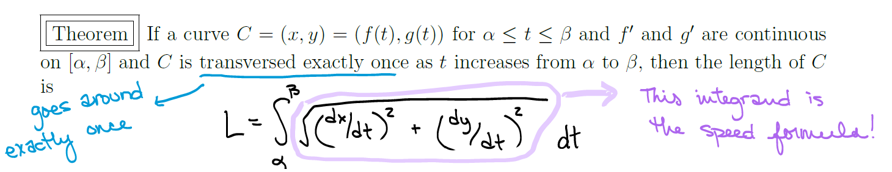
```


*   Surface Area ($x = f(t), y=g(t) $

*(x-axis)* $S = \displaystyle \int_\alpha^\beta 2\pi y\sqrt{(dx/dt)^2 + (dy/dt)^2}dt$

*(y-axis)* $S = \displaystyle \int_\alpha^\beta 2\pi x\sqrt{(dx/dt)^2 + (dy/dt)^2}dt$


### 11.3-11.4 Polar Coordinates 


*   Convert from polar to Cartesian, Cartesian to polar 
*   Sketch and identify curves in polar coordinates. KNOW HOW TO FIND/CHOOSE LIMITS OF INTEGRATION.

```{r}
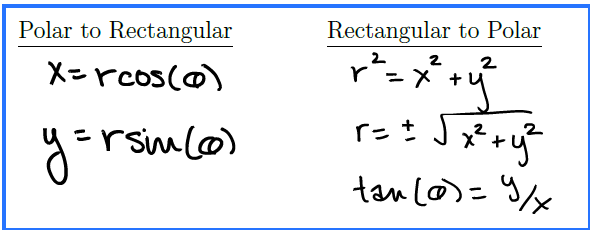
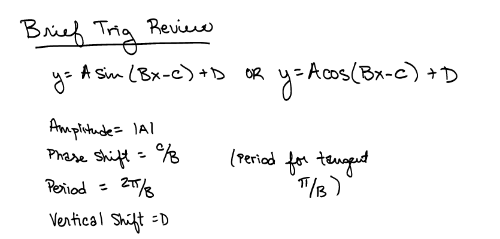

```
 
```{r}
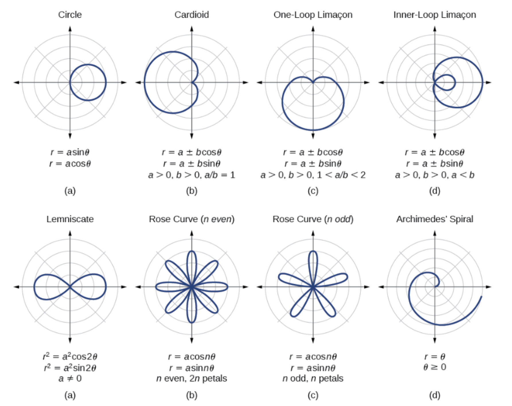

```

*   Area of sector ($r = f(\theta)$, bounded by a curve and two rays: $\theta = \alpha, \theta = \beta$):

$\displaystyle \frac{1}{2} \int_\alpha^\beta f(\theta)^2d\theta$


```{r}
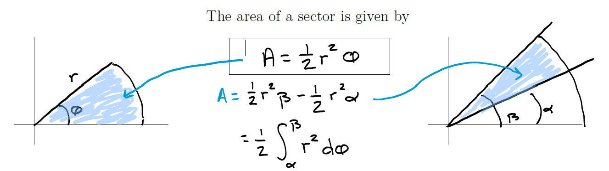

```

*  Area between two polar curves $r = f(\theta), r = g(\theta), g(\theta) \geq f(\theta)$:

$\displaystyle \frac{1}{2}\int_\alpha^\beta [g(\theta)]^2-[f(\theta)]^2d\theta$

```{r}
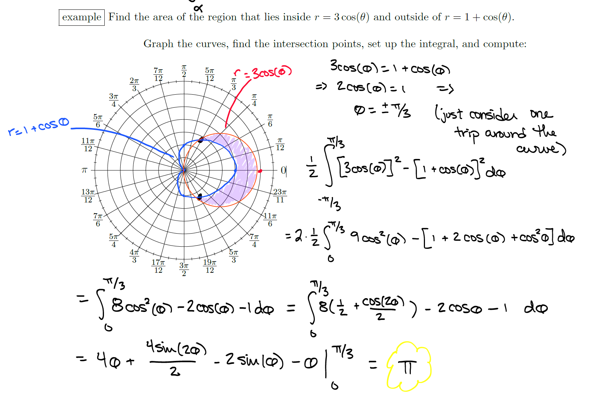

```

*   Arc length: 

$L = \displaystyle \int_a^b \sqrt{f'(\theta)^2+f(\theta)^2}d\theta = \int_a^b\sqrt{(dr/d\theta)^2+r^2}d\theta$

### 11.5 Conic Sections 

*   Hyperbolas: $(\frac{x}{a})^2 - (\frac{y}{b})^2 = 1$, asymptotes: $y = \pm \frac{b}{a}x \ \qquad (\frac{y}{a})^2 - (\frac{x}{b})^2 = 1$, asymptotes: $y = \pm \frac{a}{b}x$

```{r}
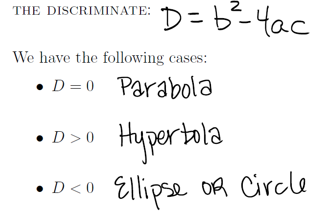

```

# Chapter 12: Vector Geometry 

### 12.1-12.2

*   Identify & sketch the 3D curve from its equation (often, complete the square)

$(x-h)^2+(y-k)^2+(z-l)^2 = r^2$ (circle)

$(x-h)^2 + (y-k)^2= r^2$ (vertical right cylinder through $(h,k,0)$)

*   Normalize a vector 

### 12.3 - Dot Product, Projections, Work

$\vec{v} \cdot \vec{w} = v_1w_1+v_2w_2+v_3w_3 = ||v||\ ||w||\cos\theta$

Geometrically, the dot product calculates the "net movement" in each axis given by the two vectors. This is why perpendicular vectors give a dot product of zero. Note that $\vec v \cdot \vec v = ||\vec v||^2$ and $\vec v \cdot \vec w = \vec w \cdot \vec v$.

*Angle b/t vectors*: $\vec{v}\cdot \vec{w} <0 \Rightarrow \theta$ obtuse, $\vec{v}\cdot \vec{w} >0 \Rightarrow \theta$ acute


**Scalar Projection**: $\displaystyle comp_{\vec{a}}\vec{b} = \frac{\vec{a}\cdot\vec{b}}{||\vec{a}||} = ||b||\cos\theta$ -- the signed magnitude of the vector projection

**Vector Projection**: $\displaystyle proj_{\vec{a}}\vec{b} = \bigg (\frac{\vec a \cdot \vec b}{||\vec a ||} \bigg ) \bigg (\frac{\vec a}{||\vec a||}\bigg)$


**Work**: $\displaystyle W = \vec{F}\cdot\vec{D} = ||\vec{D}||\ ||\vec{F}||  \cos\theta$

*   Examples/types of Work Problems 

### 12.4 Cross Product

Basic Properties of Cross Product 

*   Orthogonal: $(\vec v \times \vec w) \cdot \vec v = 0 = (\vec v \times \vec w) \cdot \vec w$ 
*   Length: $|| \vec v \times \vec w ||= || \vec v || \ || \vec w || \sin \theta$
*   Direction: *right-hand rule* `r knitr::include_graphics("12-4_fig1.png")`
*   Parallel: non-zero $\vec v, \vec w$ parallel iff $\vec v \times \vec w = 0$

```{r}
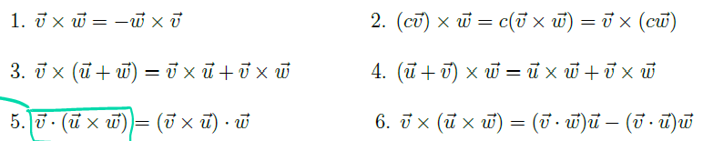
```

**1.** $\vec v \times \vec w = -\vec w \times \vec v \qquad$ **5.** $\vec v \cdot (\vec u \times \vec w) = (\vec v \times \vec u) \cdot  \vec w \qquad$ **6.** $\vec v \times (\vec w \times \vec w) = (\vec v \cdot \vec w)\vec u - (\vec v \cdot \vec u) \vec w$

**Scalar triple product**: 

```{r}
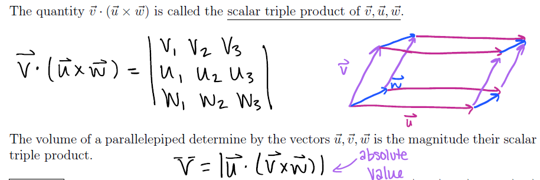
```

**Torque**:  $\displaystyle \vec \tau = \vec r \times \vec F \implies \| \vec \tau \| = \|\vec r \times \vec F \| = \|\vec r\| \|\vec F \| \sin(\theta)$


### 12.5 - Planes & Equations of Lines (from 12.2)

Find line through a point $P_0(x_0, y_0, z_0)$ in the direction of $\vec v = \langle a,b,c \rangle$

*   $\vec r(t) = \vec {r_0} + t \vec{v} = \langle x_0, y_0,z_0 \rangle + t \langle a, b, c \rangle \quad -\infty < t < \infty$ 
 
Find line through two points $P(x_0, y_0, z_0), Q(x_1, y_1, z_1)$: 

*   $\vec{r}(t) = \langle x_0, y_0, z_0 \rangle + t\langle x_1 - x_0, y_1 - y_0, z_1 - z_0 \rangle = (1-t) \langle x_0, y_0, z_0 \rangle + t \langle x_1, y_1, z_1 \rangle$

Determine if lines are parallel, intersecting, or skew (neither)

**Planes** -- The plane through $P_0(x_0, y_0, z_0)$ with normal vector $\vec{n} = \langle a,b, c \rangle$: 

*   $\underline{\text{vector form:}}$ $\vec n \cdot \langle x-x_0, y - y_0, z-z_0 \rangle = 0$
*   $\underline{\text{scalar form:}}$ $a(x-x_0) + b(y - y_0) + c(z-z_0) =0 \quad$ or $ \quad ax + by+cz = d$

Find the equation of the plane given...

|   ...a point on the plane and a normal vector
|   ...a point and parallel plane (parallel normal vectors)
|   ...a point and two planes perpendicular to it (orthogonal normal vectors)
|   ...three points on the plane

Find point where line intersects the plane

Find angle between planes: if not parallel or perpendicular, $\displaystyle \theta = \arccos \bigg (\frac{\vec {n_1} \cdot \vec {n_2}}{\|\vec{n_1}\|\|\vec{n_2}\|} \bigg)$

### 12.6 Quadratic Surfaces

*General quadratic surface:* $Ax^2+By^2+Cz^2+Dxy+Eyz+Fxz+Gx+Hy+Iz+J = 0$

Identify quadratic surfaces by formula and sketch using traces:

```{r}
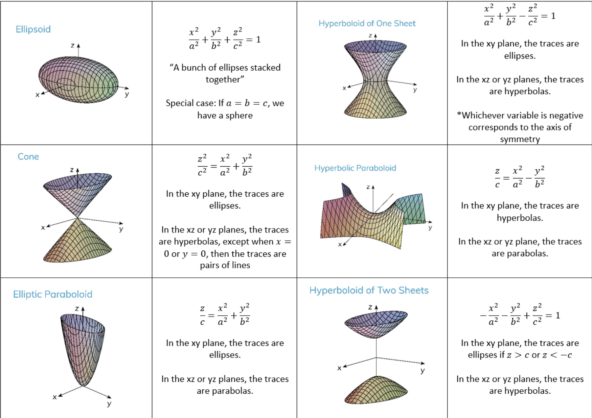
```

```{r}
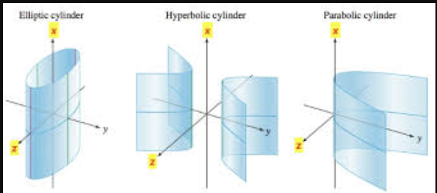
```

$(\frac{x}{a})^2 + (\frac{y}{b})^2 = 1 \qquad (\frac{x}{a})^2 - (\frac{y}{b})^2 = 1 \qquad y = ax^2$

### 12.7 - Cylindrical and Spherical Coordinates

```{r}
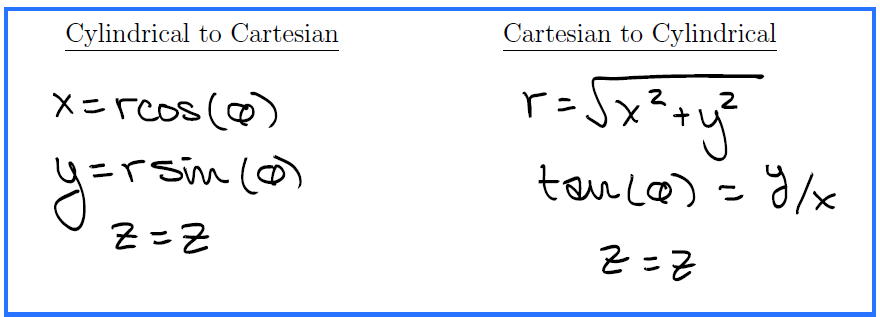
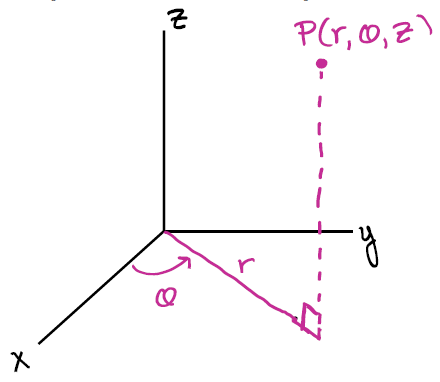

```

```{r}
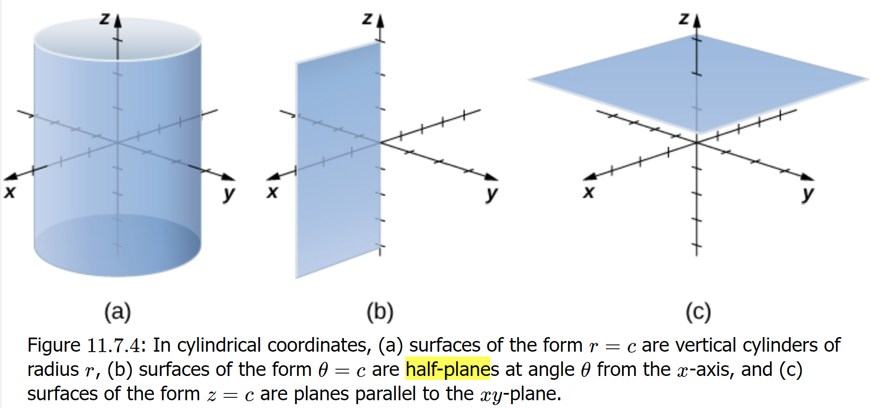
```

```{r}
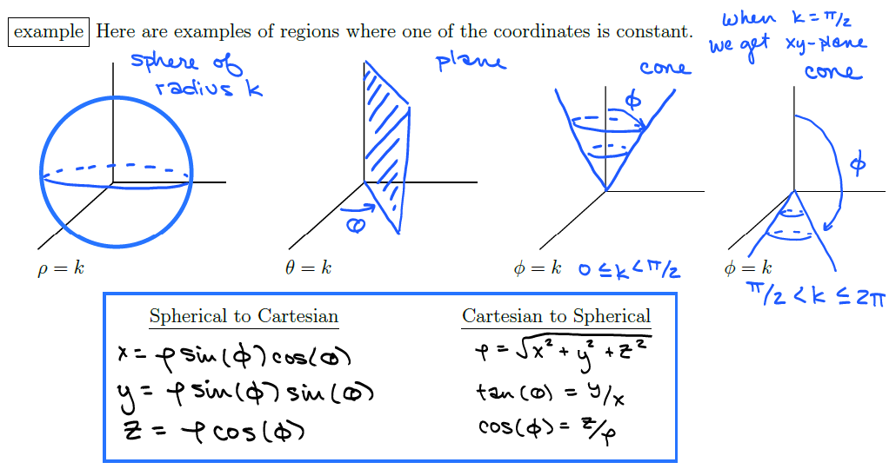
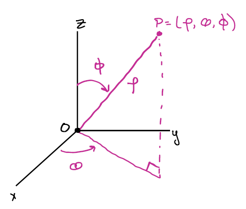
```


